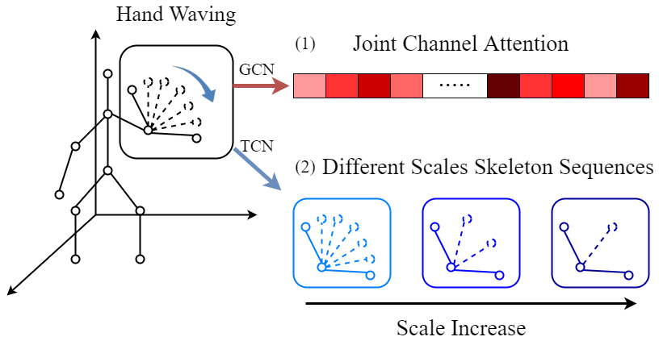
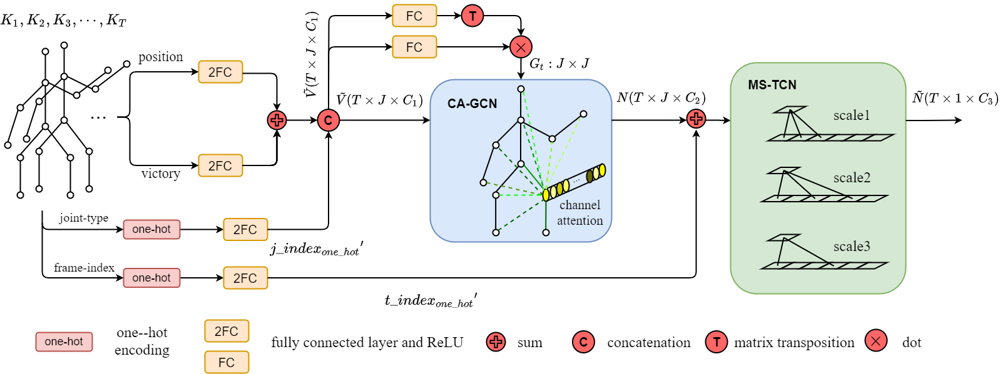

# CA-MSN-action-recognition
Ronghao Dang, Chengju Liu, Ming Liu, Qijun Chen (Under review for AI COMMUNICATIONS)

<p align="center"></p>

## Abstract
3D skeleton data has been widely used in action recognition as skeleton-based action
recognition has achieved good performance in complex dynamic environments. With
the rise of spatio-temporal graph convolution, it has been attracted much attention to
use graph convolution to extract spatial and temporal features together in the field of
skeleton-based action recognition. However, due to the huge difference in the focus of
spatial and temporal features, it is difficult to improve the efficiency of combined
extraction to spatiotemporal features. In this paper, we propose a channel attention
and multi-scale neural network (CA-MSN) for skeleton-based action recognition with a
series of spatio-temporal extraction modules. We exploit the relationship of body joints
hierarchically through two modules, i.e., a spatial module which uses the residual GCN
network with the channel attention block to extract the high-level spatial feature
between the body joints in each frame, and a temporal module which uses the multiscale
TCN network to extract the temporal feature at different scales. We perform
extensive experiments on NTU-RGBD60 and NTU-RGBD120 datasets and verify the
effectiveness of our network. The comparison results show that our method achieves
state-of-the-art performance under the premise of ensuring the calculation speed.

<p align="center"></p>

## Prerequisites
- Python 3.6
- [Anaconda](http://www.anaconda.com/)
- [Pytorch](http://pytorch.org/) 1.3

## Data Preparation

We use the dataset NTU-RGBD60 to test our CA-MSN method. We need to first download the [NTU-RGBD](http://github.com/shahroudy/NTURGB-D) dataset.

- Extract the dataset to ./data/ntu/nturgb+d_skeletons/
- Process the data
```bash
cd ./data/ntu
# Get skeleton of each performer
python get_raw_skes_data.py
# Remove the bad skeleton
python get_raw_denoised_data.py
# Transform the skeleton to the center of the first frame
python seq_transformation.py
```

## Training

```bash
# For the CS setting
python main.py --network CA-MSN --train 1 --case 0
# For the CV setting
python main.py --network CA-MSN --train 1 --case 1
```

## Testing

```bash
# For the CS setting
python main.py --network CA-MSN --train 0 --case 0
# For the CV setting
python main.py --network CA-MSN --train 0 --case 1
```


